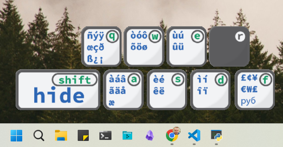

# SpecialChars
An application to make selecting special characters on a US keyboard easier.
When the application is running, pressing a hotkey combination will trigger its display.
Then using intuative selection, one can select the special character they need and it will be inserted into thier application and copy the character to the clip board.

## Usage:
Once the app has started, hide it with `<esc>`Cancel changes

Show the app again with, `<alt><alt><alt>`

Use the Hotkey letters to work through the sublevels of characters.

To exit, go to the currency symbol level and press `<shift>`
